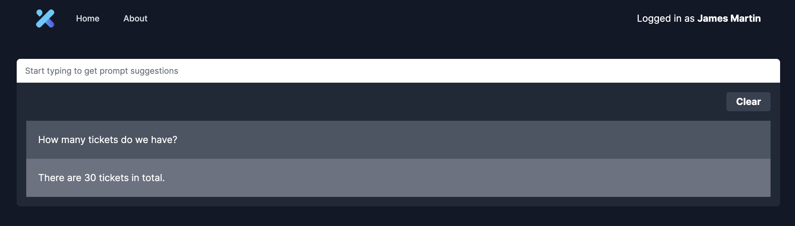

# Team Viriathus

[Live Demo](https://team-viriathus-dev.xgeeks.tech)



## How to run the application locally

The simplest way to try out this stack is to test it out locally and traverse through code files to understand how each component work. Here are the steps to get started.

### 1. Install dependencies

```sh
npm install
```

### 2. Copy from .env.local.example file

```sh
cp .env.local.example .env.local
```

### 2.1 Fill out missing secrets

Please replace the variables needed with your own credentials

### 3. Run dev server

```sh
npm run dev
```

### 4. Deploy the app

Just do your code and then push it to main branch. :rocket:
After a few seconds the changes will be live and running.
You can get some feedback, by looking the github actions pipelines, to check if they have finished.

## Refs

- https://js.langchain.com/docs/modules/indexes/vector_stores/integrations/pinecone
- https://js.langchain.com/docs/modules/models/llms/integrations#replicate
- https://js.langchain.com/docs/modules/chains/index_related_chains/retrieval_qa
